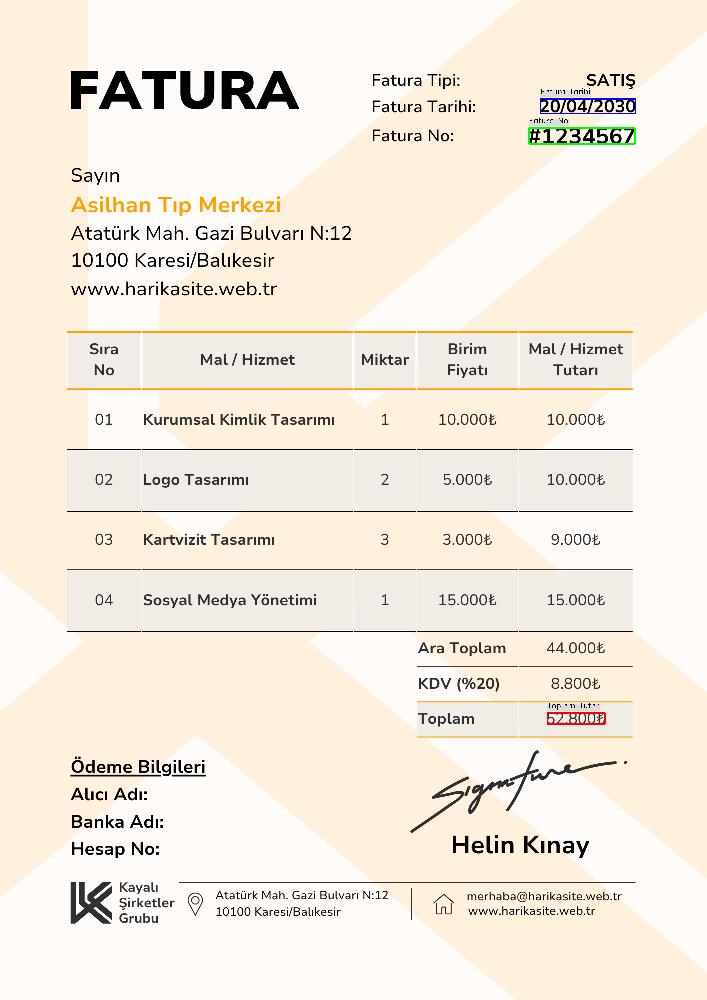
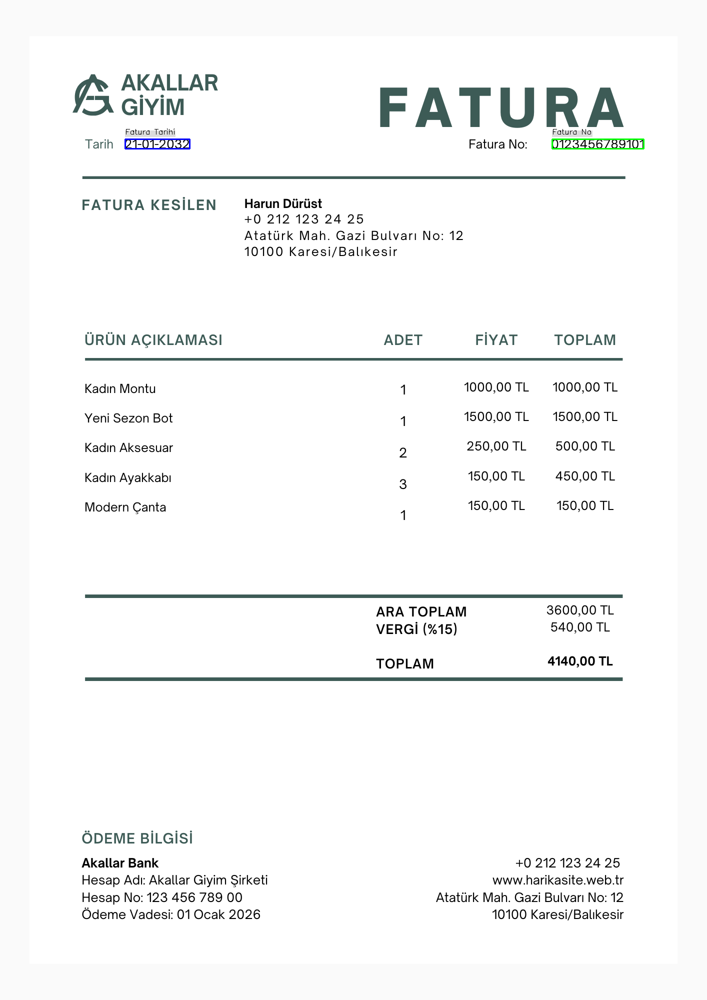
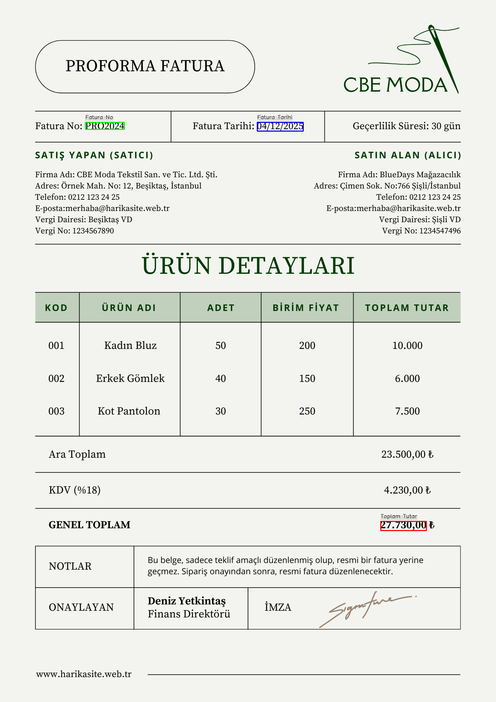

# 📄 OCR Tabanlı Fatura Bilgi Çıkarım Sistemi

Bu proje, Optik Karakter Tanıma (OCR) teknolojilerini kullanarak görsel faturalardan (ve benzeri belgelerden) tarih, toplam tutar ve fatura numarası gibi yapılandırılmış bilgileri otomatik olarak çıkarmayı amaçlayan bir Python uygulamasıdır. Çıkarılan veriler kolayca işlenebilir CSV ve JSON formatlarında kaydedilirken, ilgili alanlar orijinal görsel üzerinde görsel olarak vurgulanır.

## ✨ Özellikler

* **Akıllı OCR İşleme:** Türkçe ve İngilizce dillerini destekleyen Tesseract OCR motoru ile yüksek doğrulukta metin çıkarımı.
* **Yapılandırılmış Veri Çıkarımı:** Düzenli ifadeler (Regex) kullanarak fatura tarihi, toplam tutar ve fatura numarası gibi anahtar bilgilerin tespiti.
* **Çok Yönlü Veri Çıkışı:** Çıkarılan tüm verileri makine tarafından okunabilir CSV ve JSON formatlarında dışa aktarma.
* **Görsel Geri Bildirim:** Çıkarılan verilerin orijinal belge üzerindeki konumlarını renkli kutucuklar ve etiketlerle işaretleyerek görselleştirme.
* **Modüler ve Genişletilebilir:** Temiz, sınıf tabanlı bir mimari (InvoiceProcessor, InvoiceExtractor, InvoiceVisualizer, DataManager) sayesinde kolay bakım ve gelecekteki geliştirmeler.

## 🚀 Kurulum ve Çalıştırma

Projeyi yerel ortamınızda kurmak ve çalıştırmak oldukça basittir.

### 📋 Ön Koşullar

Başlamadan önce sisteminizde aşağıdaki yazılımların yüklü olduğundan emin olun:

* **Python**
* **Tesseract OCR Motoru:**
    * Tesseract'ı sisteminize kurmanız gerekmektedir. Windows kullanıcıları [buradan](https://tesseract-ocr.github.io/tessdoc/Downloads.html) indirme yapabilirler. Kurulum sırasında Türkçe (`tur`) ve İngilizce (`eng`) dil paketlerini seçtiğinizden emin olun.
    * Kurulum sonrası, `main.py` dosyasındaki `tesseract_path` değişkenini Tesseract'ın yürütülebilir dosyasının tam yoluna göre güncellemeniz gerekecektir.
        * **Windows Örneği:** `tesseract_path = r'C:\Program Files\Tesseract-OCR\tesseract.exe'`
        * **Linux/macOS Örneği:** `tesseract_path = None` (Eğer Tesseract PATH'inizde ise) veya `/usr/local/bin/tesseract` gibi tam yolu.

### 📦 Bağımlılıklar

Projenin tüm Python bağımlılıkları `requirements.txt` dosyasında listelenmiştir. Projenin ana dizininde aşağıdaki komutu çalıştırarak bunları kolayca yükleyebilirsiniz:

```bash
pip install -r requirements.txt
```


### Çalıştırma Adımları
**Fatura Görsellerinizi Yerleştirin:**
İşlemek istediğiniz tüm fatura, fiş veya benzeri belge görsellerini (.png, .jpg, .jpeg, .tiff, .bmp formatlarında) projenin ana dizinindeki belgeler/ klasörüne kopyalayın.

**Projeyi Başlatın:**
Projenin ana dizinine (yani main.py dosyasının bulunduğu klasöre) terminal veya komut istemcisi üzerinden gidin ve aşağıdaki komutu çalıştırın:
```bash 
python main.py
```

**Çıktıları İnceleyin:**
Programın çalışması tamamlandıktan sonra, elde edilen çıktılar aşağıdaki klasörlerde bulunacaktır:

**output_images/:** Çıkarılan alanların işaretlendiği, görselleştirilmiş faturalar.
**output_data/:** Çıkarılan yapılandırılmış veriler (.csv ve .json formatında).


   

### Örnek Çıktılar
Sistemin nasıl çalıştığını görmek için aşağıda bazı örnek çıktılar verilmiştir:

**Görselleştirilmiş Fatura Örnekleri**
Her bir girdi görseli için, çıkarılan tarih, tutar ve fatura numarası bilgileri ilgili kelimelerin üzerinde renkli kutucuklar ve etiketlerle işaretlenmiştir. Bu görseller aşağıdaki gibidir:

 
 
 
 
 


**Çıkarılan Veri Örnekleri**
**CSV Formatı(tum_faturalar_cikartilan_veriler.csv):**
İşlenen tüm faturalardan çıkarılan veriler, aşağıdaki formatlarda kaydedilir:
```bash
Fatura Tarihi,Toplam Tutar,Fatura No,Dosya Adı
20/04/2030,52800,#1234567,fatura1.png
21-01-2032,360,0123456789101,fatura2.png
04/12/2025,27730.00,PRO2024,fatura3.png

```

**JSON Formatı (tum_faturalar_cikartilan_veriler.json):**
```bash
[
    {
        "Fatura Tarihi": "20/04/2030",
        "Toplam Tutar": "52800",
        "Fatura No": "#1234567",
        "Dosya Adı": "fatura1.png"
    },
    {
        "Fatura Tarihi": "21-01-2032",
        "Toplam Tutar": "360",
        "Fatura No": "0123456789101",
        "Dosya Adı": "fatura2.png"
    },
    {
        "Fatura Tarihi": "04/12/2025",
        "Toplam Tutar": "27730.00",
        "Fatura No": "PRO2024",
        "Dosya Adı": "fatura3.png"
    }
]
```

### Gelecek Geliştirmeler
Bu projenin potansiyelini artırmak için gelecekte yapılabilecek bazı geliştirmeler şunlardır:

**Makine Öğrenimi Entegrasyonu:** Daha karmaşık fatura düzenleri ve alan tanıma için derin öğrenme modellerinin (örn. BERT, LayoutLM) entegrasyonu.
**Daha Kapsamlı Bilgi Çıkarımı:** Satıcı bilgileri, kalem detayları, KDV oranları gibi ek alanların otomatik olarak çıkarılması.
**Web Tabanlı Arayüz:** Kullanıcı dostu bir arayüz ile görsel yükleme ve sonuç görüntüleme kolaylığı.
Performans İyileştirmeleri: Büyük veri setleri için hız optimizasyonları ve paralel işleme yetenekleri.

### 🤝 Katkıda Bulunma
Bu projeye katkıda bulunmaktan çekinmeyin! Hata raporları, yeni özellik önerileri veya kod katkıları her zaman memnuniyetle karşılanır.


