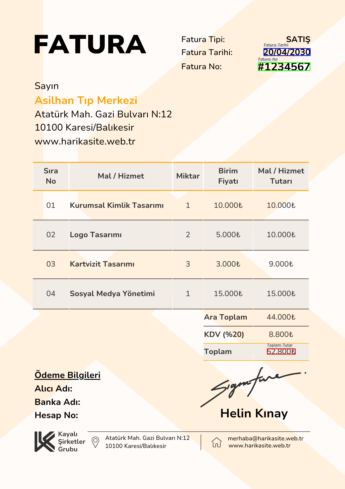
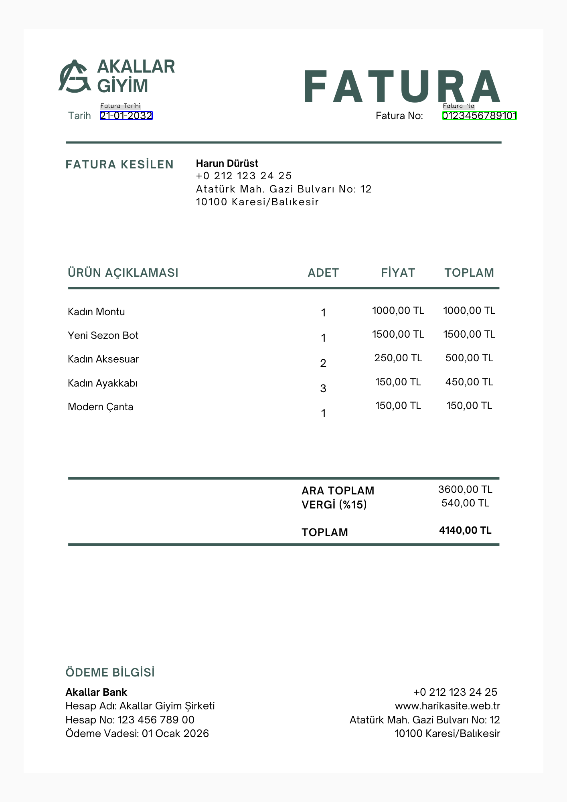
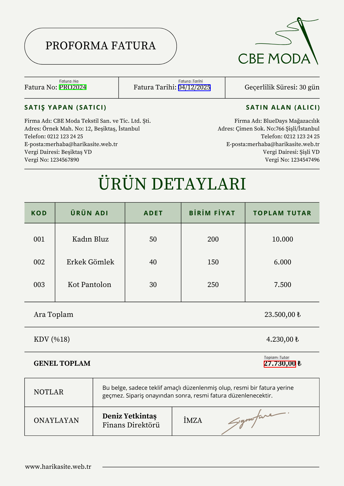

# 📄 OCR-based Invoice Information Extraction System

This project aims to automatically extract structured information (such as date, total amount, and invoice number) from visual invoices (and similar documents) using Optical Character Recognition (OCR) technologies. The extracted data is saved in easily processable CSV and JSON formats, while the corresponding fields are visually highlighted on the original image.


## ✨ Features

* **Intelligent OCR Processing:** High-accuracy text extraction using the Tesseract OCR engine, supporting Turkish and English languages.
* **Structured Data Extraction:** Detection of key information like invoice date, total amount, and invoice number using Regular Expressions (Regex).
* **Versatile Data Output:** Exporting all extracted data into machine-readable CSV and JSON formats.
* **Visual Feedback:** Highlighting the location of extracted data on the original document images with colored bounding boxes and labels.
* **Modular and Extensible:** A clean, class-based architecture (InvoiceProcessor, InvoiceExtractor, InvoiceVisualizer, DataManager) for easy maintenance and future enhancements.


## 🚀 Setup and Running

Setting up and running the project in your local environment is quite straightforward.

### 📋 Prerequisites

Before you begin, ensure that you have the following software installed on your system:

* **Python**
* **Tesseract OCR Engine:**
    * You need to install Tesseract on your system. Windows users can download it [here](https://tesseract-ocr.github.io/tessdoc/Downloads.html). Make sure to select Turkish (`tur`) and English (`eng`) language packs during installation.
    * After installation, you will need to update the `tesseract_path` variable in the `main.py` file to the exact path of the Tesseract executable on your system.
        * **Windows Example:** `tesseract_path = r'C:\Program Files\Tesseract-OCR\tesseract.exe'`
        * **Linux/macOS Example:** `tesseract_path = None` (If Tesseract is in your PATH) or `/usr/local/bin/tesseract` (e.g., if installed via Homebrew on macOS).


### 📦 Dependencies

All Python dependencies for the project are listed in the `requirements.txt` file. You can easily install them by running the following command in the project's root directory:

```bash
pip install -r requirements.txt
```

### 
🏃‍♂️ Running Steps

1.  **Place Your Invoice Images:**
    Copy all invoice, receipt, or similar document images (`.png`, `.jpg`, `.jpeg`, `.tiff`, `.bmp` formats) that you want to process into the `belgeler/` (documents) folder in the project's root directory.

2.  **Start the Project:**
    Navigate to the project's root directory (the folder containing `main.py`) via your terminal or command prompt and run the following command:

```bash 
python main.py
```


3.  **Inspect the Outputs:**
    After the program completes its execution, the generated outputs will be found in the following folders:

    * **`output_images/`:** Visualized invoices with the extracted fields highlighted.
    * **`output_data/`:** Extracted structured data in `.csv` and `.json` formats.
    

    


### 📊 Example Outputs

Below are some examples of outputs to demonstrate how the system works:

#### Visualized Invoice Examples

For each input image, the extracted date, amount, and invoice number information is highlighted with colored bounding boxes and labels over the corresponding text. These images are as follows:

 
 
 
 
 


#### Extracted Data Examples

**CSV Format (`tum_faturalar_cikartilan_veriler.csv`):**
Data extracted from all processed invoices is saved in the following formats:
```bash
Fatura Tarihi,Toplam Tutar,Fatura No,Dosya Adı
20/04/2030,52800,#1234567,fatura1.png
21-01-2032,360,0123456789101,fatura2.png
04/12/2025,27730.00,PRO2024,fatura3.png
```


**JSON Format (`tum_faturalar_cikartilan_veriler.json`):**
```bash
[
    {
        "Fatura Tarihi": "20/04/2030",
        "Toplam Tutar": "52800",
        "Fatura No": "#1234567",
        "Dosya Adı": "fatura1.png"
    },
    {
        "Fatura Tarihi": "21-01-2032",
        "Toplam Tutar": "360",
        "Fatura No": "0123456789101",
        "Dosya Adı": "fatura2.png"
    },
    {
        "Fatura Tarihi": "04/12/2025",
        "Toplam Tutar": "27730.00",
        "Fatura No": "PRO2024",
        "Dosya Adı": "fatura3.png"
    }
]
```


### 🔮 Future Enhancements

Some potential future enhancements to increase this project's capabilities include:

* **Machine Learning Integration:** Integration of deep learning models (e.g., BERT, LayoutLM) for more complex invoice layouts and field recognition.
* **More Comprehensive Information Extraction:** Automatic extraction of additional fields such as vendor information, item details, and VAT rates.
* **Web-Based Interface:** Developing a user-friendly web interface for easy image uploading and result viewing.
* **Performance Optimizations:** Exploring speed optimizations and parallel processing capabilities for large datasets.

### 🤝 Contributing

Feel free to contribute to this project! Bug reports, new feature suggestions, or code contributions are always welcome.


